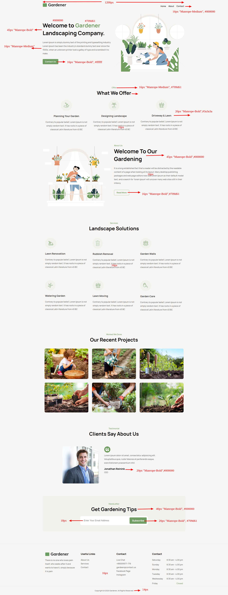
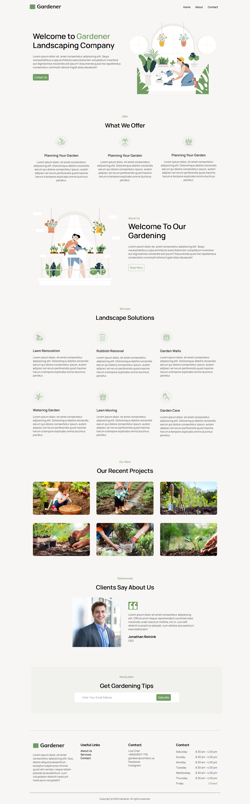

# Responsive Web Design
## Assignment 1 - Gardener Website
#### Current Issues:

How to give uniform sizes for project images
Client image alignment issue
Get gardening tips and email id margins overlapping
Timing flex not working properly
How to not select recursively
Landscape and recent project bottom padding
### Design

### Webpage Screenshot
